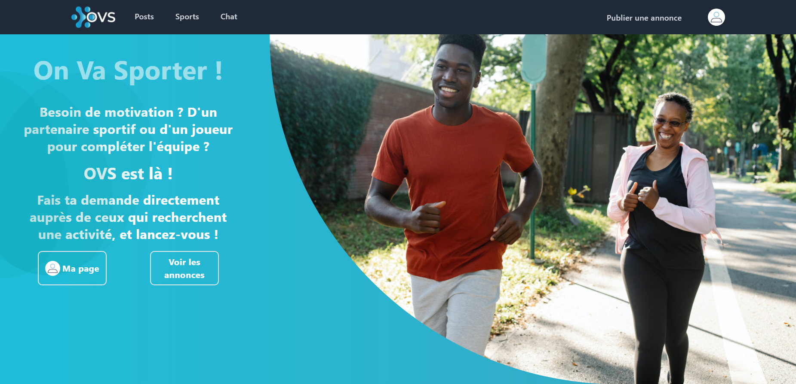
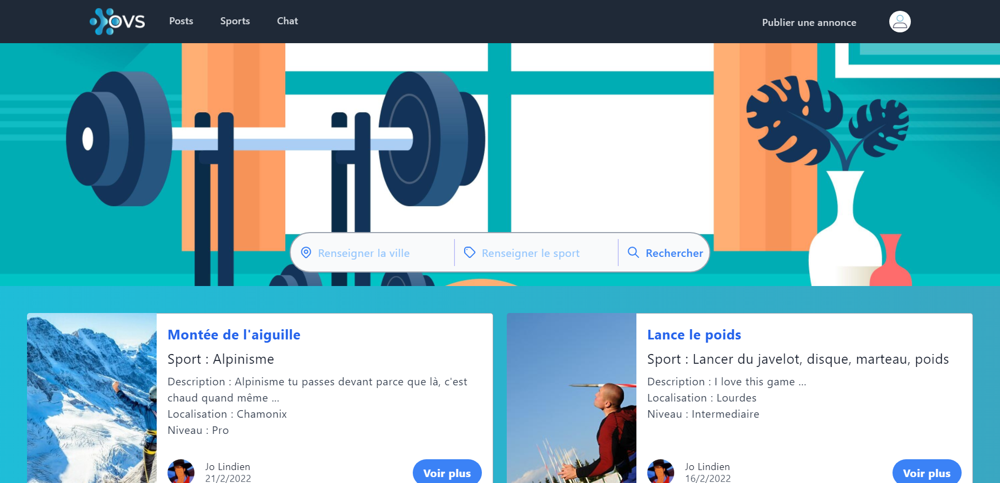
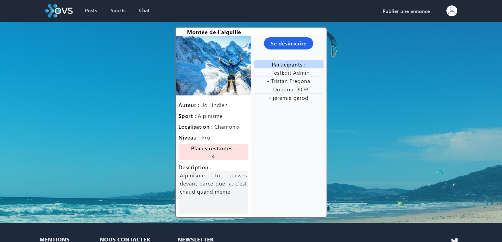
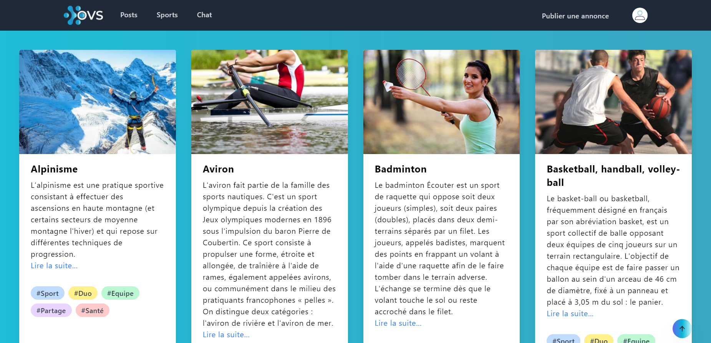
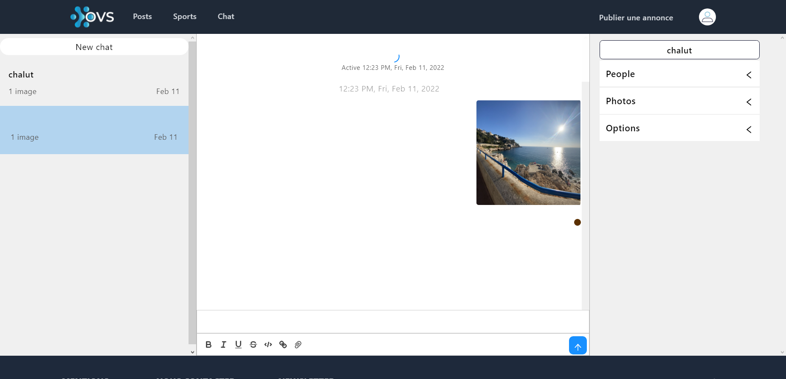
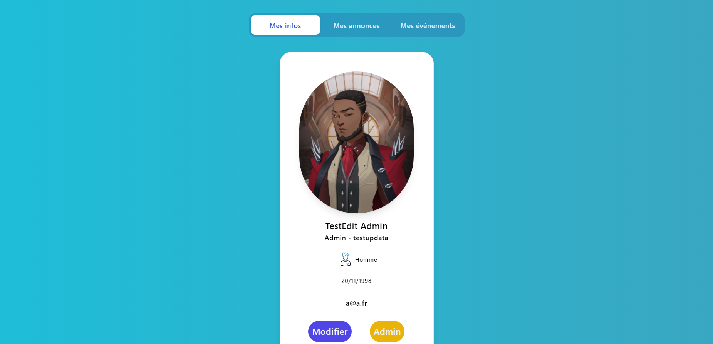

# On Va Sporter

OVS is an EPITECH school project, the goal is to create a web app and an API.
OVS's dedicated to those looking for sports partner. 

# Requirements

For use OVS you have to start API.

For more details check Api and OVS README.md

## App Preview

### Home

  

### Posts

  

### Post

  

### sports

  

### chat

  

### Profile

  

##

- [DIOP Doudou](https://github.com/Douzdiop)
- [FREGONA Tristan](https://github.com/Tfregona)
- [GABILLOUX Jérôme](https://github.com/jgabilloux)
- [GAROD Jeremie](https://github.com/JeremieG06)
- [PEREIRA-VARELA Jessy](https://github.com/Jessy06)
- [SULON Adrien](https://github.com/asulon1)
